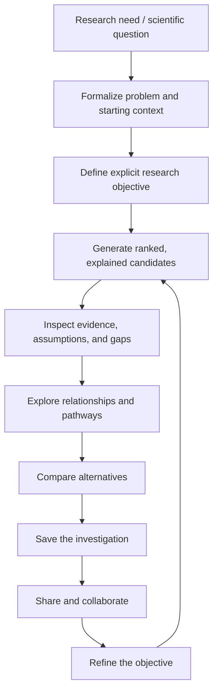
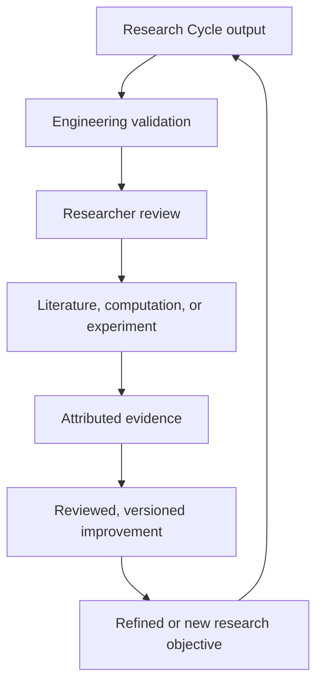
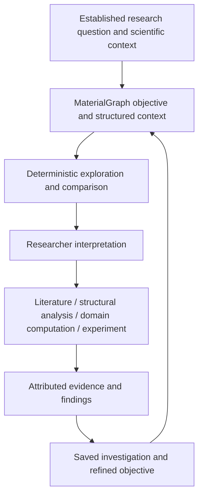
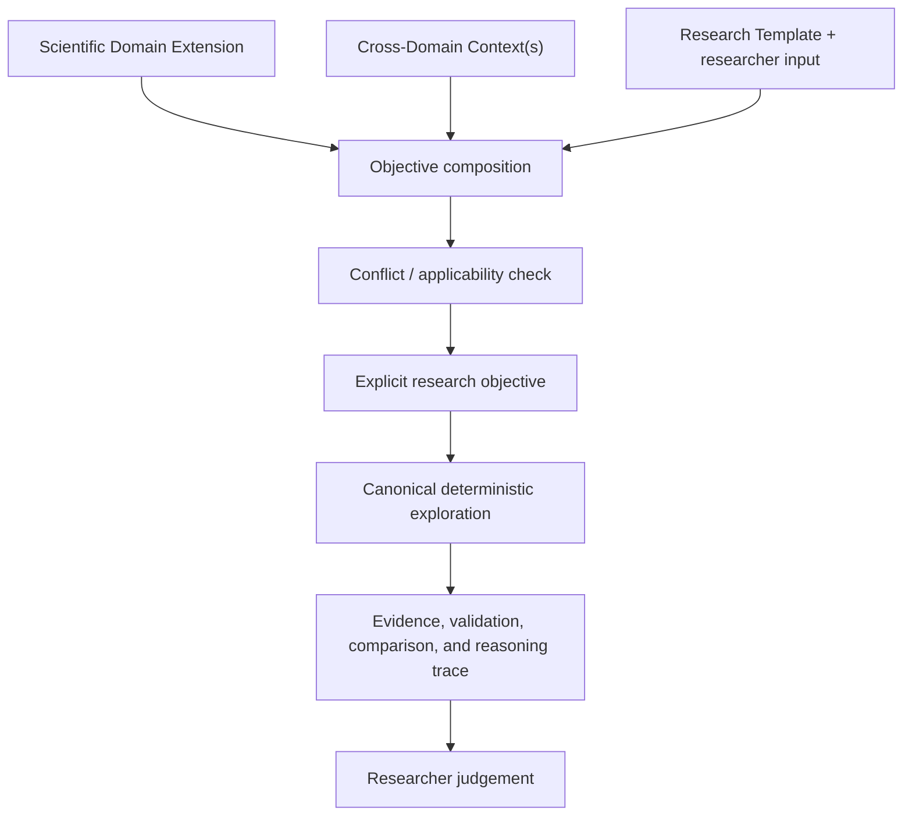
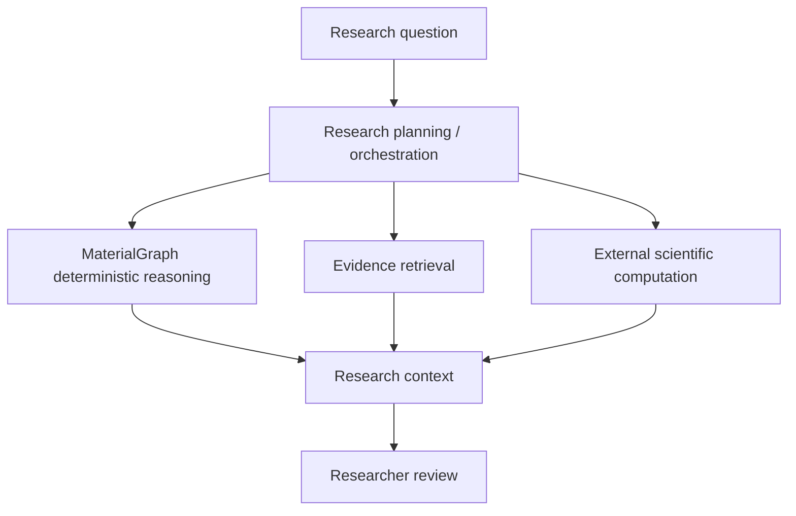

# MaterialGraph Research Architecture

## Overview

MaterialGraph is a deterministic research-assistance platform. It computes,
ranks, compares, and explains material opportunities while researchers retain
authority over interpretation, selection, and validation.

Its outputs are hypotheses and prioritization signals—not proof of novelty,
structural preservation, synthesis feasibility, physical performance, or
scientific correctness.

---

## The MaterialGraph Research Cycle

The researcher-facing architecture should support one continuous investigation
rather than expose the intelligence layers as disconnected tools.

This cycle is the primary product workflow. The deterministic intelligence
pipeline supplies the opportunities, explanations, evidence context, and
comparisons used within it. The researcher retains authority over selection,
interpretation, and validation at every stage.

### Researcher-in-the-loop validation flow

Engineering checks establish that MaterialGraph behaves as specified.
Researchers and appropriate external methods determine whether an opportunity
is scientifically meaningful. Reviewed evidence may strengthen future
investigations, but it must not silently become canonical truth.

---

## Research Workflow Compatibility

The MaterialGraph Research Cycle is a researcher-facing framework, not a claim
that all materials research follows one identical sequence. MaterialGraph should
fit established scientific practice before attempting to change it, and should
enhance that practice only where researcher evidence or validated use cases show
that the enhancement is useful.

The architecture should preserve the following relationship:

MaterialGraph may structure and connect steps that researchers already perform,
but it must not silently redefine a scientific method, validation requirement,
or domain-specific decision rule. Established scientific tools and methods should
remain responsible for the computations or experimental procedures they are
designed to perform. MaterialGraph should preserve the surrounding research
context, objective, provenance, assumptions, evidence state, and resulting
decisions.

### Common framework and domain-specific workflows

The architecture should support a stable common research framework together with
domain-specific extensions. Shared concepts may include:

- research objective and constraints;
- material, structure, property, and evidence context;
- deterministic exploration and candidate generation;
- comparison and trade-off inspection;
- provenance and uncertainty;
- validation need and validation status;
- researcher interpretation and decision history;
- iteration and versioned investigation state.

Domain-specific workflows may add requirements for, for example, crystal
structure, electrochemical conditions, defects, interfaces, synthesis routes,
thermodynamic state, force fields, calculation settings, laboratory procedures,
or application-specific acceptance criteria.

A domain extension must not weaken canonical MaterialGraph semantics. It should
state which shared services it reuses, which domain-specific evidence or methods
it requires, which external system owns scientific execution, and how results
return as attributed evidence.

### Domain-extensible research architecture

MaterialGraph should separate **domain-independent scientific-reasoning
semantics** from **domain-specific scientific meaning**.

The shared Core should own reusable scientific-reasoning semantics such as
objective and constraint classes, evidence and epistemic states, provenance,
applicability, validation-state structure, reasoning-pathway semantics,
deterministic graph reasoning, conflict detection, investigation versioning, and
reasoning traces.

The Core should not define which electrochemical, mechanical, catalytic,
biological, or other domain-specific thresholds constitute scientific
acceptability. Those meanings belong to reviewed domain extensions.

#### Scientific Domain Extensions

A Scientific Domain Extension may define domain-specific terminology,
properties, evidence requirements, applicability conditions, validation
criteria, accepted external methods, warnings, and research templates.

An extension is not scientifically trusted merely because its configuration is
valid; its scientific basis and applicability require review and validation.

#### Cross-Domain Decision Contexts

Supply risk, sustainability, economics, regulation, and organization-specific
qualification are better represented as composable decision contexts when they
legitimately apply across multiple scientific domains.

A cross-domain context may contribute constraints, preferences, evidence, or
warnings, but it must not silently redefine canonical domain science.

#### Validation-aware reasoning contract

The Core should represent validation requirements and states consistently, while
the active domain extension defines which validation requirements apply and what
evidence can satisfy them.

A validation requirement may need to preserve identity, required evidence class,
applicability, blocking/non-blocking status, current state, supporting or
contradictory evidence, provenance, uncertainty, and review status.

MaterialGraph may report that a candidate lacks domain-appropriate validation.
It must not claim to replace the domain-specific validation itself unless that
activity is explicitly implemented through an appropriate validated workflow.

#### Research templates

A domain research template is a versioned scientific artifact, not merely a
frontend preset, when it encodes assumptions about problem formalization.

Templates should preserve domain/context applicability, version and attribution,
scientific basis and review status, default objective structure, default
hard/soft constraints and preferences, assumptions and proxies, validation
requirements, and known limitations where applicable.

Researchers should be able to inspect and modify template-derived assumptions
before execution. A researcher with a precise objective may bypass templates.

#### Conflict and applicability resolution

Composition can create contradictions. Before deterministic reasoning begins,
MaterialGraph should detect conflicts expressible from explicit semantics,
including incompatible hard constraints, contradictory template assumptions, or
context rules outside the active domain's applicability.

The Core may detect and explain the conflict; it should not silently choose which
scientific priority wins. Where judgement is required, the researcher resolves
the conflict and the resulting decision should be preserved in the reasoning
trace.

#### Extension authoring and governance

Scientifically appropriate portions of a domain extension should eventually be
declarative and expert-maintainable without forcing every domain change into
Core application code.

Extension flexibility must be paired with governance. Domain rules, templates,
evidence mappings, and validation criteria should be attributable, versioned,
reviewable, testable, and validated for their intended scope.

Learned or AI-assisted proposals may help identify possible extension changes in
the future, but they must enter the same evidence, expert-review, testing, and
versioning path as human-authored proposals before influencing trusted
deterministic behavior.

### Workflow validation requirement

The current Research Cycle should remain revisable until it has been tested
against representative research practice. Workflow validation should include:

1. documented case studies representing different materials-science questions;
2. observation or structured interviews with relevant researchers where
   available;
3. comparison between current researcher steps and proposed MaterialGraph
   interactions;
4. identification of steps that MaterialGraph should support, integrate, or
   leave to established tools;
5. explicit recording of workflow mismatches, missing states, and confusing
   terminology;
6. revision of frontend and research orchestration when evidence justifies it.

A workflow mismatch should be treated as a product or architecture finding. The
researcher should not be expected to change a scientifically appropriate method
simply to satisfy the application's page flow.

---

## Problem Formalization

A researcher may begin with either a precise objective or an incompletely specified
research need. MaterialGraph should support translation of the latter into a
computable objective without silently choosing scientific priorities for the
researcher.

Problem formalization should preserve, where applicable:

- the original research need or question;
- starting material, family, application, or other scientific context;
- assumptions introduced during formalization;
- candidate hard constraints, soft constraints, and preferences;
- preservation requirements and target context;
- treatment of unknown evidence;
- exploration bounds and exploration policy.

Suggested interpretations must remain inspectable and editable. If MaterialGraph
operationalizes a vague term such as cost, safety, sustainability, or performance
using a particular proxy, the proxy and assumption must remain visible in the
saved investigation. A researcher with an already explicit objective may bypass
this support step.

---

## Research Objective

A research objective expresses the intended exploration, for example:

- replace lithium while preserving specified elemental continuity;
- reduce known criticality while maintaining a stability requirement;
- explore sodium-containing alternatives;
- investigate transition-metal substitutions.

An objective must distinguish preferences, soft constraints, hard endpoint
constraints, and hard path-wide constraints. Unknown evidence cannot satisfy a
hard constraint unless explicitly allowed.

### Exploration Policy

Exploration policy is distinct from the scientific constraints themselves. It
describes how broadly MaterialGraph should search within the eligible scientific
space. A future objective specification may support explicit policies such as:

- **targeted / conservative** --- emphasize objective satisfaction, stronger
  evidence, and close or well-supported graph neighborhoods;
- **balanced** --- preserve objective alignment while allowing controlled novelty;
- **exploratory** --- surface unusual pathways, sparsely explored regions, or more
  distant opportunities when hard constraints still permit them.

Changing exploration policy may change prioritization and which eligible regions
are surfaced, but it must not silently weaken hard constraints or mutate canonical
knowledge. The policy must be stored with the investigation for reproducibility.

---

## Deterministic Exploration

Current implemented services combine:

- discovery candidates and chains;
- research-objective exploration and evaluation;
- graph traversal and path ranking;
- material quality and graph analytics;
- community and subgraph intelligence;
- scientific pathway analysis;
- comparative research intelligence;
- endpoint-sensitive research ranking;
- evidence summaries and validation priorities.

These services identify opportunities supported by MaterialGraph's current
source data, derived measurements, and encoded rules. “Implemented” does not
mean independently scientifically validated.

---

## Research Opportunities

MaterialGraph should present multiple inspectable opportunities rather than
declare one scientifically correct answer.

Each opportunity should expose:

- source data and provenance;
- derived scores and rule-based inferences;
- strengths and trade-offs;
- warnings, assumptions, and missing evidence;
- objective and constraint satisfaction;
- internal support and external evidence coverage;
- validation priorities.

The word **discovery** refers to computational exploration and prioritization,
not experimental discovery or novelty confirmation.

---

## Scientific Pathway Analysis

Scientific pathway analysis is implemented. It evaluates encoded pathway
properties such as:

- elemental continuity;
- introduced and removed elements;
- material-family relationships;
- graph connectivity;
- intermediate and endpoint information;
- material quality;
- objective alignment;
- comparative trade-offs.

These are model-derived analyses. They do not prove a physical transformation
mechanism, structural preservation, pathway feasibility, or synthesis
feasibility.

Research-facing terminology should therefore distinguish:

- **reasoning pathway** --- an inspectable sequence of encoded graph relationships
  explaining why an opportunity is connected to the starting context;
- **transformation pathway** --- a proposed scientifically meaningful sequence of
  transformations or transitions requiring appropriate physical evidence and
  validation;
- **synthesis pathway** --- an experimentally supported or otherwise appropriately
  evidenced route under stated conditions.

MaterialGraph's current graph/path analysis should be interpreted as reasoning or
pathway hypotheses unless stronger evidence explicitly justifies another type.

---

## Confidence, Evidence, and Readiness

Research-facing outputs must separate:

| Dimension | Meaning |
|---|---|
| Internal rule support | Support produced by MaterialGraph's encoded relationships and rules |
| Data completeness | Availability of required source fields |
| External evidence coverage | Relevant literature, computation, structural, or experimental evidence |
| Validation readiness | Clarity and availability of next validation steps |
| Scientific validation status | Researcher, computational, or experimental validation actually completed |

An internally strong pathway can still have no external validation evidence.
“Confidence” is not a probability of scientific correctness.

---

## Researcher Selection and Validation

Researchers evaluate opportunities using considerations outside the graph,
including domain knowledge, laboratory capability, resources, safety,
industrial constraints, and research goals.

Validation may require:

- literature review;
- crystallographic or structural comparison;
- DFT or other domain computation;
- molecular dynamics;
- synthesis work;
- laboratory measurement;
- peer review.

MaterialGraph does not replace any of these activities.

---

## Evidence and Knowledge Enrichment

A future scientific knowledge layer may record:

- research projects and investigation sessions;
- literature and attributed observations;
- simulation and structural-analysis results;
- successful and unsuccessful experiments;
- disagreement and review status.

Evidence must preserve provenance and must not automatically become system
truth. Reviewed evidence may enter a later versioned dataset, rule, or scoring
policy through an explicit governance process.

Evidence records should preserve enough epistemic context to determine what an
item can legitimately support. Depending on evidence type, relevant fields may
include contributor and source, evidence basis, method, material/structure/local
context, conditions and parameters, number of observations or runs where
meaningful, uncertainty, review status, corroboration, contradiction, and
applicability limits. Access scope, evidence quantity, and scientific strength are
separate dimensions. A single failed experiment may be important context without
becoming a universal negative claim.

### Private and Scoped Research Context

Scientific evidence may exist at different access scopes, including shared or
canonical context, organization-private context, project or workspace context,
and researcher-scoped context. Access scope and scientific validity are separate
dimensions.

Private evidence may inform investigations for authorized researchers without
silently becoming shared or canonical MaterialGraph knowledge. Conflicts between
private and public evidence should remain inspectable rather than being
automatically reconciled. Any promotion of scoped evidence into shared or
canonical knowledge must use an explicit review and governance process while
preserving contributor, source, version, and validation provenance.

### Global and Local Scientific Context

MaterialGraph should distinguish evidence that applies at different scientific
resolutions. Material- or composition-level similarity does not establish
equivalence of phase, structure, or scientifically important local environments.
Future structural and validation workflows may therefore need to distinguish:

- material and composition context;
- phase and crystal-structure context;
- coordination and substitution-site environments;
- defects and disorder;
- interfaces and surfaces;
- local bonding or other domain-specific local structures.

When a research question depends on local behavior, favourable global signals
must not hide missing or contradictory local evidence. Missing local evidence
should remain an explicit validation gap.

### Future Research Orchestration Boundary

A future research workflow may coordinate multiple specialized capabilities, but
planning, deterministic reasoning, evidence retrieval, scientific execution, and
researcher judgement should remain distinct responsibilities.

Future orchestration should consume canonical MaterialGraph outputs rather than
reimplement their scoring, constraints, evidence semantics, or graph reasoning.
An AI or rule-based planner may coordinate appropriate capabilities, but it must
not silently become the scientific authority for deterministic MaterialGraph
reasoning or external physical computation.

---

## Reproducible Investigation and Reasoning Trace

A saved investigation should preserve enough information to explain not only the
final ranked opportunities but the major decisions that constructed the research
space. Where applicable, the trace should include:

- original research need and formalization assumptions;
- explicit objective, constraints, unknown-handling policy, and exploration policy;
- source-data, evidence, configuration, rule, and software versions;
- candidate eligibility decisions and hard-constraint rejection reasons;
- traversal and reasoning pathways used to construct opportunities;
- score decomposition, warnings, trade-offs, and evidence state;
- researcher selections, overrides, annotations, and preserved rationale;
- subsequent validation outcomes as attributed evidence.

An ineligible candidate may disappear from the ranked result while its exclusion
reason remains available in the reasoning trace. This allows later objective
changes to be inspected rather than making the previous search space appear as if
it never existed.

Longer term, a preserved investigation may be replayed against the same or a newer
knowledge state. Replay should report what changed because of objective changes
versus data, evidence, rules, configuration, or software changes. It must remain
version-aware and should not imply scientific equivalence between evidence states.

---

## Current Validation Status

| Validation type | Current status |
|---|---|
| Unit and regression testing | Implemented; coverage continues to expand |
| API and deterministic-behaviour verification | Implemented for tested workflows |
| Architecture and implementation audit (`MG-AUD-*`) | Complete: 92 remediated, 2 accepted behavior, 0 open |
| Independent implementation audit (`MG-IA-*`) | Closed: 20 of 20 actionable findings verified; 1 post-freeze invalidation |
| Stage 1 security review (`MG-SEC-*`) | In progress as a separate workstream |
| Literature-backed case studies | Not yet completed |
| Independent materials-researcher review | Not yet completed |
| DFT cross-validation | Not yet completed |
| Experimental validation | Not completed |

---

## Long-Term Direction

MaterialGraph will strengthen deterministic graph intelligence, research
workflows, evidence provenance, and collaborative knowledge management while
preserving researcher authority and explicit scientific-validation boundaries.

Longer term, the research architecture should support validated scientific domain
extensions, composable cross-domain decision contexts, and versioned research
templates without requiring domain-specific scientific meaning to be hard-coded
into the Core.