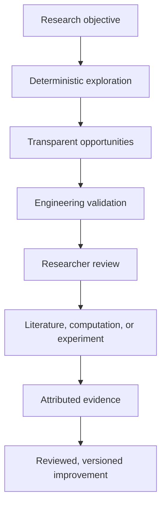

# MaterialGraph Research Architecture

## Overview

MaterialGraph is a deterministic research-assistance platform. It computes,
ranks, compares, and explains material opportunities while researchers retain
authority over interpretation, selection, and validation.

Its outputs are hypotheses and prioritization signals—not proof of novelty,
structural preservation, synthesis feasibility, physical performance, or
scientific correctness.

---

## Researcher-in-the-Loop Workflow

Engineering checks establish that MaterialGraph behaves as specified.
Researchers and appropriate external methods determine whether an opportunity
is scientifically meaningful.

---

## Research Objective

A research objective expresses the intended exploration, for example:

- replace lithium while preserving specified elemental continuity;
- reduce known criticality while maintaining a stability requirement;
- explore sodium-containing alternatives;
- investigate transition-metal substitutions.

An objective must distinguish preferences, soft constraints, hard endpoint
constraints, and hard path-wide constraints. Unknown evidence cannot satisfy a
hard constraint unless explicitly allowed.

---

## Deterministic Exploration

Current implemented services combine:

- discovery candidates and chains;
- research-objective exploration and evaluation;
- graph traversal and path ranking;
- material quality and graph analytics;
- community and subgraph intelligence;
- scientific pathway analysis;
- comparative research intelligence;
- endpoint-sensitive research ranking;
- evidence summaries and validation priorities.

These services identify opportunities supported by MaterialGraph's current
source data, derived measurements, and encoded rules. “Implemented” does not
mean independently scientifically validated.

---

## Research Opportunities

MaterialGraph should present multiple inspectable opportunities rather than
declare one scientifically correct answer.

Each opportunity should expose:

- source data and provenance;
- derived scores and rule-based inferences;
- strengths and trade-offs;
- warnings, assumptions, and missing evidence;
- objective and constraint satisfaction;
- internal support and external evidence coverage;
- validation priorities.

The word **discovery** refers to computational exploration and prioritization,
not experimental discovery or novelty confirmation.

---

## Scientific Pathway Analysis

Scientific pathway analysis is implemented. It evaluates encoded pathway
properties such as:

- elemental continuity;
- introduced and removed elements;
- material-family relationships;
- graph connectivity;
- intermediate and endpoint information;
- material quality;
- objective alignment;
- comparative trade-offs.

These are model-derived analyses. They do not prove a physical transformation
mechanism, structural preservation, pathway feasibility, or synthesis
feasibility.

---

## Confidence, Evidence, and Readiness

Research-facing outputs must separate:

| Dimension | Meaning |
|---|---|
| Internal rule support | Support produced by MaterialGraph's encoded relationships and rules |
| Data completeness | Availability of required source fields |
| External evidence coverage | Relevant literature, computation, structural, or experimental evidence |
| Validation readiness | Clarity and availability of next validation steps |
| Scientific validation status | Researcher, computational, or experimental validation actually completed |

An internally strong pathway can still have no external validation evidence.
“Confidence” is not a probability of scientific correctness.

---

## Researcher Selection and Validation

Researchers evaluate opportunities using considerations outside the graph,
including domain knowledge, laboratory capability, resources, safety,
industrial constraints, and research goals.

Validation may require:

- literature review;
- crystallographic or structural comparison;
- DFT or other domain computation;
- molecular dynamics;
- synthesis work;
- laboratory measurement;
- peer review.

MaterialGraph does not replace any of these activities.

---

## Evidence and Knowledge Enrichment

A future scientific knowledge layer may record:

- research projects and investigation sessions;
- literature and attributed observations;
- simulation and structural-analysis results;
- successful and unsuccessful experiments;
- disagreement and review status.

Evidence must preserve provenance and must not automatically become system
truth. Reviewed evidence may enter a later versioned dataset, rule, or scoring
policy through an explicit governance process.

---

## Current Validation Status

| Validation type | Current status |
|---|---|
| Unit and regression testing | Implemented; coverage continues to expand |
| API and deterministic-behaviour verification | Implemented for tested workflows |
| Architecture and implementation audit | Reconciled; remediation in progress |
| Literature-backed case studies | Not yet completed |
| Independent materials-researcher review | Not yet completed |
| DFT cross-validation | Not yet completed |
| Experimental validation | Not completed |

---

## Long-Term Direction

MaterialGraph will strengthen deterministic graph intelligence, research
workflows, evidence provenance, and collaborative knowledge management while
preserving researcher authority and explicit scientific-validation boundaries.
