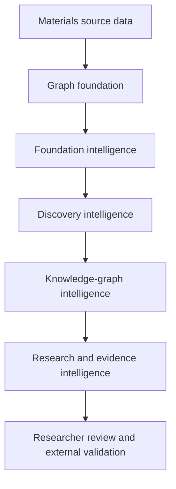
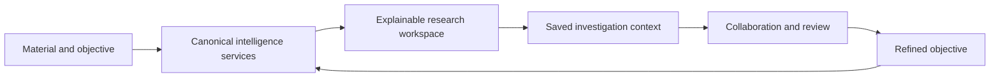
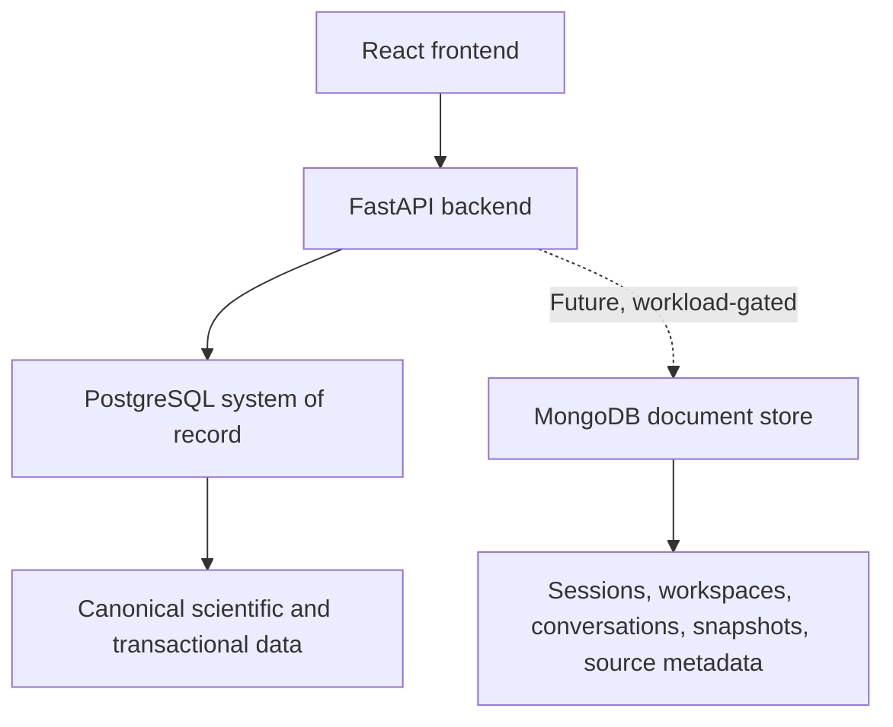

# MaterialGraph System Architecture

## Overview

MaterialGraph is a layered, deterministic knowledge-graph platform for
materials research assistance and decision support.

It converts source data into inspectable computational opportunities through
explicit graph construction, scoring, objective evaluation, and comparison.
The system does not establish scientific validity; researchers remain
responsible for interpretation and external validation.

---

## Intelligence Layers

### Research Experience Architecture

The intelligence layers should be exposed through the **MaterialGraph Research
Cycle**: start from a material, define an objective, generate explained
candidates, inspect evidence, explore pathways, compare alternatives, save and
share the investigation, and refine the objective.

This cycle is a researcher-facing orchestration boundary rather than a new
scientific-computation layer. It should compose canonical outputs from the
existing services, preserve investigation context and provenance, and avoid
reimplementing scoring, constraints, evidence interpretation, or graph
semantics in the frontend or workspace layer.

### Graph Foundation

**Purpose**

- represent materials and explicit relationships;
- preserve source identifiers and provenance;
- construct graph nodes and edges;
- provide persistence and canonical composition data.

### Foundation Intelligence

**Question:** What is known or computed about an individual material and its
immediate relationships?

**Implemented services**

- Material Graph;
- Neighborhood;
- Material Families;
- Similarity;
- Recommendation;
- Criticality;
- Scenario Policies.

### Discovery Intelligence

**Question:** Which computational opportunities warrant investigation?

**Implemented services**

- Discovery Candidates;
- Explainable Scoring and Warnings;
- Substitution Paths;
- Discovery Chains;
- Path Ranking;
- Research-Objective Exploration.

Discovery outputs are ranked hypotheses derived from current data and encoded
rules—not validated discoveries.

### Knowledge-Graph Intelligence

**Question:** How are materials connected within MaterialGraph's model?

**Implemented services**

- Graph Builder and Traversal;
- BFS, DFS, Dijkstra, and K-best path workflows;
- Graph Analytics;
- Community Detection and Community Intelligence;
- Ranked Subgraph Exploration;
- Material Quality;
- Node and Edge Intelligence.

Graph relationships and communities are model constructs unless supported by
separate external validation evidence.

### Research and Evidence Intelligence

**Question:** How can multiple opportunities be compared for a research
objective?

**Implemented services**

- Research-Objective Exploration and Evaluation;
- Scientific Pathway Analysis;
- Research Opportunity Analysis;
- Comparative Research Intelligence;
- Endpoint-Sensitive Research Ranking;
- Evidence Summaries;
- Missing-Evidence and Weak-Assumption Reporting;
- Validation Priorities and Evidence Readiness.

Internal support, data completeness, external evidence coverage, validation
readiness, and scientific-validation status must remain separate concepts.

### Scientific Knowledge Layer

**Planned purpose**

- store attributed literature, observations, simulations, and experiments;
- preserve investigation and validation history;
- support review, disagreement, and versioned knowledge enrichment.

This layer must not silently alter deterministic computation. Reviewed evidence
may influence an explicitly versioned dataset or policy.

---

## Cross-Cutting Architecture

| Concern | Architectural requirement |
|---|---|
| Provenance | Trace outputs to source data, rules, configuration, and software version |
| Validation status | Separate engineering verification from researcher, computational, and experimental validation |
| Uncertainty | Preserve unknown values; never treat missing evidence as favourable |
| Canonical semantics | Reuse one implementation for composition, scoring, constraints, evidence, and ties |
| API contracts | Validate inputs consistently and expose explicit response schemas |
| Persistence | Preserve graph, evidence, and job-state integrity |
| Background jobs | Provide atomic claiming, consistent transitions, ownership, and bounded execution |
| Security | Enforce authentication, authorization, resource ownership, and bounded inputs |
| Observability | Record failures, performance, version context, and audit-relevant events |
| Performance | Optimize without changing graph or scientific semantics |

---

## Runtime Architecture

### Data Persistence Strategy

PostgreSQL is MaterialGraph's authoritative system of record. The current
scientific core depends on well-defined relationships, joins, constraints,
transactions, deterministic querying, indexing, and versioned schema
migrations.

The following records remain in PostgreSQL:

- materials, elements, and normalized material compositions;
- material relationships and graph persistence;
- criticality and risk data;
- discovery, recommendation, and objective-evaluation records;
- graph-job state and other transactional application records;
- canonical provenance, configuration, and validation-status records.

MaterialGraph may later introduce MongoDB as a secondary document store when a
validated product feature has a genuinely document-oriented access pattern.
Candidate workloads include:

- saved research sessions containing objectives, generated results,
  visualization state, notes, and bookmarks;
- user workspaces, collections, dashboards, and saved searches;
- optional AI-assistant conversations, tool outputs, and interaction metadata;
- immutable or versioned graph-result snapshots;
- heterogeneous metadata ingested from literature, patent, chemical, or
  materials-data sources.

MongoDB would complement PostgreSQL rather than replace it. Canonical material,
relationship, criticality, discovery, and recommendation data must not be
duplicated into a second competing system of record.

Before adopting MongoDB, the proposed workload must be evaluated against
PostgreSQL JSONB, Redis, object storage, and other simpler alternatives. The
decision should consider query patterns, consistency requirements, retention,
cost, backup and recovery, observability, security, operational burden, and
data ownership. Storing a value as JSON is not by itself sufficient
justification for adding a document database.

Heterogeneous scientific metadata must retain source attribution, source-schema
version, ingestion version, normalization status, validation status, and links
to canonical PostgreSQL entities regardless of its storage engine. Cached or
derived documents must record their source-data, configuration, and software
versions and must never become an untracked authority for scientific outputs.

### Backend

- Python;
- FastAPI;
- SQLAlchemy;
- Pydantic v2;
- NetworkX;
- Alembic.

### Data and Infrastructure

- PostgreSQL / Neon PostgreSQL;
- AWS EC2;
- Nginx;
- systemd;
- Docker for local development.

### Verification

- pytest;
- deterministic regression tests;
- API and production endpoint checks;
- architecture and implementation audit.

Production endpoint verification confirms only the tested request, deployed
version, and dataset. It does not establish complete regression coverage,
concurrency safety, authorization correctness, large-dataset performance, or
scientific validity.

---

## Current Engineering Status

The listed intelligence services are implemented, but the project is undergoing
reconciled architecture and implementation audit remediation.

The canonical audit register contains 94 findings: 23 resolved within their
documented engineering scope and 71 requiring remediation or a policy decision
at the time of this architecture update.

MaterialGraph has not yet completed independent materials-researcher review,
literature-backed case studies, DFT cross-validation, or experimental
validation.

---

## Planned Architecture

- Research Gap Analysis and Hypothesis Exploration;
- versioned Scientific Knowledge Layer;
- optional workload-validated document storage for research sessions,
  workspaces, AI conversations, snapshots, or heterogeneous source metadata;
- stronger authentication, authorization, and job ownership;
- Go GraphCompute Worker;
- Rust graph engine;
- distributed, bounded graph jobs;
- graph embeddings and carefully governed ML integration.