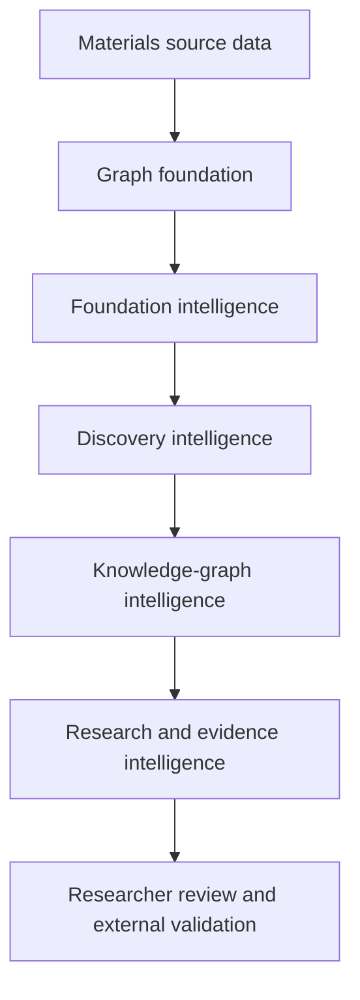
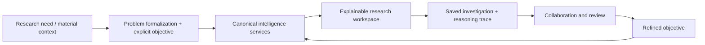
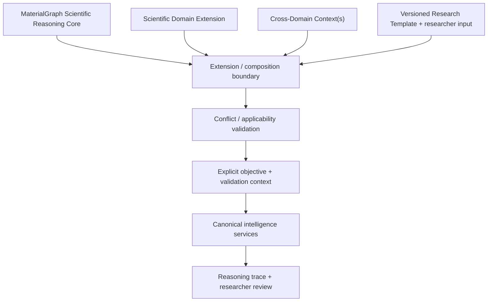
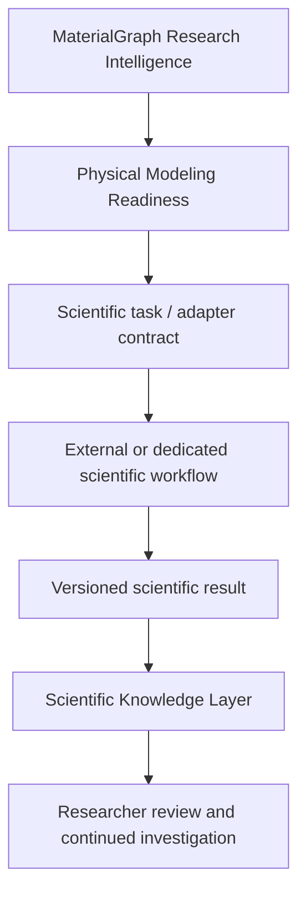
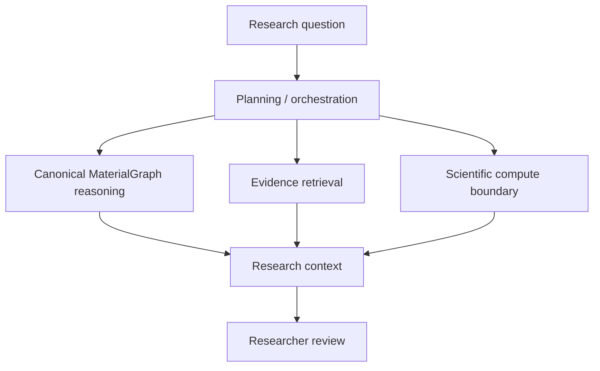
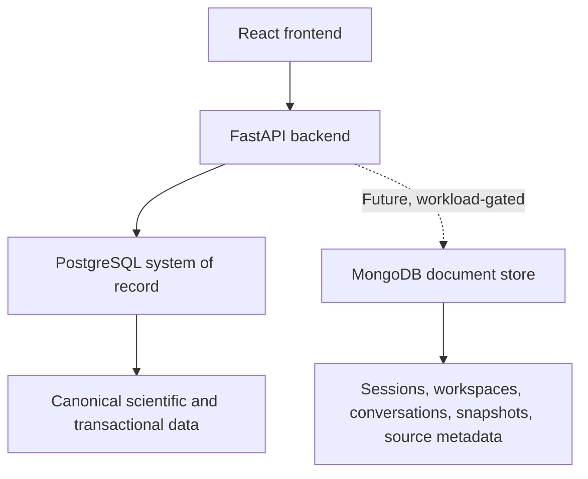

# MaterialGraph System Architecture

## Overview

MaterialGraph is a layered, deterministic knowledge-graph platform for
materials research assistance and decision support.

It converts source data into inspectable computational opportunities through
explicit graph construction, scoring, objective evaluation, and comparison.
The system does not establish scientific validity; researchers remain
responsible for interpretation and external validation.

---

## Intelligence Layers

### Research Experience Architecture

The intelligence layers should be exposed through the **MaterialGraph Research
Cycle**: begin from a research need or scientific question, formalize the problem
and starting context where needed, define an explicit objective, generate explained
candidates, inspect evidence, explore pathways, compare alternatives, save and
share the investigation, and refine the objective.

This cycle is a researcher-facing orchestration boundary rather than a new
scientific-computation layer. It should compose canonical outputs from the
existing services, preserve investigation context and provenance, and avoid
reimplementing scoring, constraints, evidence interpretation, or graph
semantics in the frontend or workspace layer.

### Planned Problem Formalization and Objective Context Boundary

The research-experience layer may help convert an incompletely specified research
need into an explicit objective, but this support must remain separate from
canonical scientific computation. It should preserve the original request, any
introduced assumptions or proxies, the resulting hard/soft constraints and
preferences, unknown-handling policy, exploration bounds, and exploration policy.

Suggested objective structure must be inspectable and editable by the researcher.
The frontend or future planner must call canonical constraint and objective
semantics rather than inventing parallel interpretations.

### Planned Domain Extension and Context Composition Boundary

MaterialGraph should evolve toward a domain-extensible architecture in which the
Core owns reusable scientific-reasoning semantics while extensions provide
domain-specific scientific meaning.

The Core should remain responsible for canonical objective and constraint
semantics, evidence and epistemic states, provenance and applicability,
validation-state representation, pathway semantics, deterministic graph
reasoning, conflict detection, and reproducible investigation state.

Scientific Domain Extensions should define domain-specific properties,
terminology, evidence expectations, applicability conditions, validation
requirements, external scientific methods, and research templates.

Cross-Domain Contexts may contribute concerns such as supply risk,
sustainability, economics, regulation, or organization-specific qualification
where those concerns legitimately apply across several scientific domains.

The extension boundary is planned, not implemented. No named domain should be
presented as supported until representative workflows, scientific semantics,
evidence requirements, validation criteria, and researcher usefulness have been
established.

#### Validation requirement contract

The Core should represent validation requirements and states without deciding
their domain-specific scientific content. A future contract may include
requirement identity, evidence class, applicability, blocking/non-blocking state,
satisfaction state, supporting or contradictory evidence, provenance,
uncertainty, and review status.

The active domain extension owns the definition of which requirements apply and
what evidence can legitimately satisfy them.

#### Versioned research templates

Research templates should be treated as versioned domain artifacts when they
encode objective defaults, assumptions, proxies, constraints, preferences,
applicability, or validation requirements. Template identity and version should
be preserved in the investigation, and researchers must be able to inspect or
modify template-derived assumptions before execution.

#### Conflict and applicability validation

Composition must not imply automatic consistency. Canonical logic should detect
contradictions expressible from available semantics, such as incompatible hard
constraints or explicit applicability conflicts, before a composed objective is
executed.

The system may block execution or require researcher resolution when a conflict
makes the objective incoherent. It must not silently select one scientific
priority over another.

#### Extension governance

Scientifically meaningful extension content should be attributable, versioned,
reviewable, testable, and replaceable. Declarative configuration is preferred
where it reduces unnecessary Core coupling, but configuration validity is not a
substitute for scientific validation.

Future learned or AI-assisted extension proposals should enter as untrusted
proposals and pass through evidence, expert review, testing, and versioning
before influencing canonical deterministic behavior.

### Graph Foundation

**Purpose**

- represent materials and explicit relationships;
- preserve source identifiers and provenance;
- construct graph nodes and edges;
- provide persistence and canonical composition data.

### Foundation Intelligence

**Question:** What is known or computed about an individual material and its
immediate relationships?

**Implemented services**

- Material Graph;
- Neighborhood;
- Material Families;
- Similarity;
- Recommendation;
- Criticality;
- Scenario Policies.

### Discovery Intelligence

**Question:** Which computational opportunities warrant investigation?

**Implemented services**

- Discovery Candidates;
- Explainable Scoring and Warnings;
- Substitution Paths;
- Discovery Chains;
- Path Ranking;
- Research-Objective Exploration.

Discovery outputs are ranked hypotheses derived from current data and encoded
rules—not validated discoveries.

### Knowledge-Graph Intelligence

**Question:** How are materials connected within MaterialGraph's model?

**Implemented services**

- Graph Builder and Traversal;
- BFS, DFS, Dijkstra, and K-best path workflows;
- Graph Analytics;
- Community Detection and Community Intelligence;
- Ranked Subgraph Exploration;
- Material Quality;
- Node and Edge Intelligence.

Graph relationships and communities are model constructs unless supported by
separate external validation evidence.

### Research and Evidence Intelligence

**Question:** How can multiple opportunities be compared for a research
objective?

**Implemented services**

- Research-Objective Exploration and Evaluation;
- Scientific Pathway Analysis;
- Research Opportunity Analysis;
- Comparative Research Intelligence;
- Endpoint-Sensitive Research Ranking;
- Evidence Summaries;
- Missing-Evidence and Weak-Assumption Reporting;
- Validation Priorities and Evidence Readiness.

Internal support, data completeness, external evidence coverage, validation
readiness, and scientific-validation status must remain separate concepts.

Pathway outputs should also carry an explicit semantic type where the product
exposes different scientific meanings: reasoning pathway, proposed transformation
pathway, or evidence-supported synthesis pathway. Current graph/path analysis must
not be promoted to a physical transformation or synthesis claim without the
required evidence.

### Scientific Knowledge Layer

**Planned purpose**

- store attributed literature, observations, simulations, and experiments;
- preserve successful, unsuccessful, inconclusive, and conflicting results;
- preserve investigation and validation history;
- support canonical/shared, organization-private, project/workspace, and other
  explicitly scoped research evidence;
- preserve contributor, source, access-scope, review, disagreement, and version
  provenance;
- preserve epistemic context such as evidence basis, method, scientific conditions,
  relevant material/structure/local context, sample or run count where meaningful,
  uncertainty, corroboration, contradiction, and applicability limitations;
- support review, disagreement, and versioned knowledge enrichment.

Evidence scope and canonical scientific status are separate dimensions. Private
or project-scoped evidence may inform authorized investigations without silently
becoming shared MaterialGraph knowledge. This layer must not silently alter
deterministic computation. Reviewed evidence may influence an explicitly
versioned dataset or policy only through an explicit governance process.

### Planned Scientific Compute Boundary

MaterialGraph should integrate with specialized scientific computation without
becoming a general-purpose simulator. Research Intelligence may identify a
validation need and Physical Modeling Readiness may determine whether required
inputs and assumptions are sufficiently specified. Execution should then occur
through an adapter or scientific-task contract appropriate to the external or
dedicated workflow.

Potential workflows may include DFT and electronic-structure calculations,
molecular dynamics, structural analysis, spectroscopy-oriented workflows,
thermodynamic or electrochemical modeling, and other domain computation where a
validated research use case requires them.

Scientific task and result contracts should preserve, where applicable:

- material and structure identity;
- research objective and requested property or validation question;
- engine, software version, and adapter version;
- parameters, conditions, configuration, and assumptions;
- input and output artifacts;
- execution and convergence status;
- uncertainty and warnings;
- provenance and validation status.

External results enter MaterialGraph as attributed computational evidence.
Execution success or numerical convergence must not automatically be interpreted
as physical validity or experimental agreement.

### Planned Investigation and Reasoning Trace

Saved research state should eventually preserve a version-aware reasoning trace in
addition to user-facing notes and result snapshots. Depending on the workflow, the
trace may include:

- original research need and problem-formalization assumptions;
- explicit objective, constraints, unknown policy, and exploration policy;
- candidate eligibility and hard-constraint rejection reasons;
- graph traversal and reasoning-pathway decisions;
- score decomposition, evidence state, warnings, and trade-offs;
- source-data, configuration, rule, evidence, and software versions;
- researcher overrides, annotations, decisions, and later validation outcomes.

The trace should distinguish an excluded candidate from one that was never
generated, and should preserve enough version context to support future replay or
change analysis. A replay mechanism must report version differences rather than
pretend that results from different evidence states are directly equivalent.

### Future Research Orchestration Boundary

The Research Experience Architecture may later coordinate deterministic
MaterialGraph reasoning, evidence retrieval, Physical Modeling Readiness,
external scientific computation, and researcher review. Planning and
orchestration are not themselves new scientific authorities.

A future AI or rule-based planner should call and compose canonical services
rather than recreate scoring, constraints, evidence interpretation, graph
semantics, or domain computation. This preserves the separation between research
planning, deterministic reasoning, scientific execution, and researcher
judgement.

---

## Cross-Cutting Architecture

| Concern | Architectural requirement |
|---|---|
| Provenance | Trace outputs to source data, rules, configuration, and software version |
| Reasoning trace | Preserve objective context, eligibility/rejection decisions, pathway reasoning, and researcher rationale where applicable |
| Epistemic evidence context | Keep source, conditions, method, scope, corroboration, contradiction, uncertainty, and applicability distinct from mere evidence presence |
| Exploration policy | Keep search posture explicit and separate from hard/soft scientific constraints |
| Domain extension ownership | Keep domain-independent reasoning semantics in the Core and domain-specific scientific meaning in reviewed extensions |
| Context composition | Distinguish Scientific Domain Extensions from cross-domain decision contexts and preserve active versions in the investigation |
| Conflict detection | Detect explicit contradictions or applicability conflicts before composed objectives drive deterministic reasoning |
| Validation status | Separate engineering verification from researcher, computational, and experimental validation; let extensions define domain requirements while the Core preserves validation semantics |
| Uncertainty | Preserve unknown values; never treat missing evidence as favourable |
| Canonical semantics | Reuse one implementation for composition, scoring, constraints, evidence, and ties |
| API contracts | Validate inputs consistently and expose explicit response schemas |
| Persistence | Preserve graph, evidence, and job-state integrity |
| Background jobs | Provide atomic claiming, consistent transitions, ownership, and bounded execution |
| Security | Enforce authentication, authorization, resource ownership, and bounded inputs |
| Observability | Record failures, performance, version context, and audit-relevant events |
| Performance | Optimize without changing graph or scientific semantics |

---

## Runtime Architecture

### Data Persistence Strategy

PostgreSQL is MaterialGraph's authoritative system of record. The current
scientific core depends on well-defined relationships, joins, constraints,
transactions, deterministic querying, indexing, and versioned schema
migrations.

The following records remain in PostgreSQL:

- materials, elements, and normalized material compositions;
- material relationships and graph persistence;
- criticality and risk data;
- discovery, recommendation, and objective-evaluation records;
- graph-job state and other transactional application records;
- canonical provenance, configuration, and validation-status records.

MaterialGraph may later introduce MongoDB as a secondary document store when a
validated product feature has a genuinely document-oriented access pattern.
Candidate workloads include:

- saved research sessions containing objectives, generated results,
  visualization state, notes, and bookmarks;
- user workspaces, collections, dashboards, and saved searches;
- optional AI-assistant conversations, tool outputs, and interaction metadata;
- immutable or versioned graph-result snapshots;
- heterogeneous metadata ingested from literature, patent, chemical, or
  materials-data sources.

MongoDB would complement PostgreSQL rather than replace it. Canonical material,
relationship, criticality, discovery, and recommendation data must not be
duplicated into a second competing system of record.

Before adopting MongoDB, the proposed workload must be evaluated against
PostgreSQL JSONB, Redis, object storage, and other simpler alternatives. The
decision should consider query patterns, consistency requirements, retention,
cost, backup and recovery, observability, security, operational burden, and
data ownership. Storing a value as JSON is not by itself sufficient
justification for adding a document database.

Heterogeneous scientific metadata must retain source attribution, source-schema
version, ingestion version, normalization status, validation status, and links
to canonical PostgreSQL entities regardless of its storage engine. Cached or
derived documents must record their source-data, configuration, and software
versions and must never become an untracked authority for scientific outputs.

### Backend

- Python;
- FastAPI;
- SQLAlchemy;
- Pydantic v2;
- NetworkX;
- Alembic.

### Data and Infrastructure

- PostgreSQL / Neon PostgreSQL;
- AWS EC2;
- Nginx;
- systemd;
- Docker for local development.

### Verification

- pytest;
- deterministic regression tests;
- API and production endpoint checks;
- architecture and implementation audit.

Production endpoint verification confirms only the tested request, deployed
version, and dataset. It does not establish complete regression coverage,
concurrency safety, authorization correctness, large-dataset performance, or
scientific validity.

---

## Current Engineering Status

The listed intelligence services are implemented. The canonical architecture and
implementation audit (`MG-AUD-*`) is complete: 92 findings were remediated and 2
were recorded as accepted behavior, with 0 open. The later independent
implementation audit (`MG-IA-*`) is closed with all 20 actionable findings
verified and 1 post-freeze invalidation recorded. The separate Stage 1 security
review (`MG-SEC-*`) remains in progress.

These closures establish engineering status only within their documented scopes.
MaterialGraph has not yet completed independent materials-researcher review,
literature-backed case studies, DFT cross-validation, or experimental
validation.

---

## Planned Architecture

- Problem Formalization and explicit Objective Context, including inspectable assumptions and exploration policy;
- validated Domain Extension and Cross-Domain Context contracts, including versioned research templates, validation-requirement semantics, and conflict/applicability checks;
- Research Gap Analysis and Hypothesis Exploration with an explicit targeted/balanced/exploratory search posture;
- versioned Scientific Knowledge Layer with explicit evidence scope, epistemic context, and canonicalization governance;
- version-aware Investigation / Reasoning Trace with preserved eligibility and rejection decisions;
- Physical Modeling Readiness and adapter-oriented external scientific compute integration;
- future research orchestration that composes canonical reasoning, evidence, and scientific compute without duplicating their semantics;
- optional workload-validated document storage for research sessions,
  workspaces, AI conversations, snapshots, or heterogeneous source metadata;
- stronger authentication, authorization, and job ownership;
- Go GraphCompute Worker;
- Rust graph engine;
- distributed, bounded graph jobs;
- graph embeddings and carefully governed ML integration.